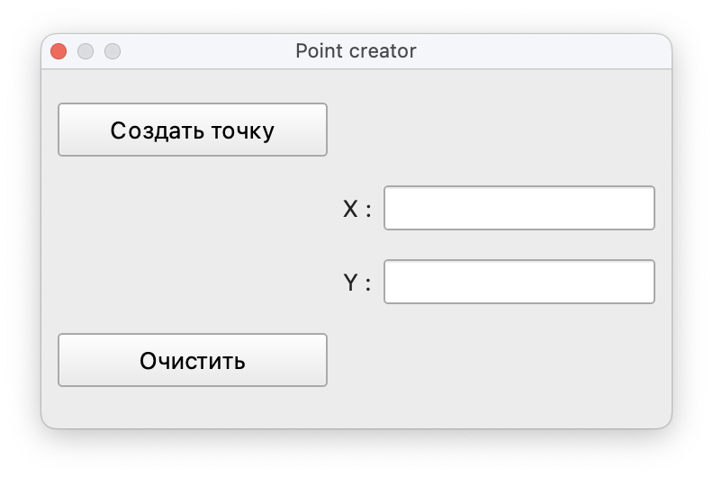

# Point-creator

Plugin for QGIS designed to plot points on the layer.

<b>Install:</b>

  1. Go to menu Settings -> User profiles -> Open active profile folder 
From there, you can go to python -> plugins. That's the plugin folder for QGIS v3. 
On my GNU/Linux machine:
/home/USER/.local/share/QGIS/QGIS3/profiles/default/python/plugins 
On a Windows machine:
 C:\Users\USER\AppData\Roaming\QGIS\QGIS3\profiles\default\python\plugins 
In those paths, USER will change by yours and default might change as well if you're using another profile. 

  2. Open QGIS on your computer 
  3. Click on Plugins -> Manage and Install Plugins 
  4. Click on the Installed and search for Point-creator 
  5. Сheck the box next to the plugin 

  In the x and y fields, enter the corresponding coordinates of the point. To draw a point on a layer, click "Создать точку". 
  To clear the fields from values, click "Очистить".

